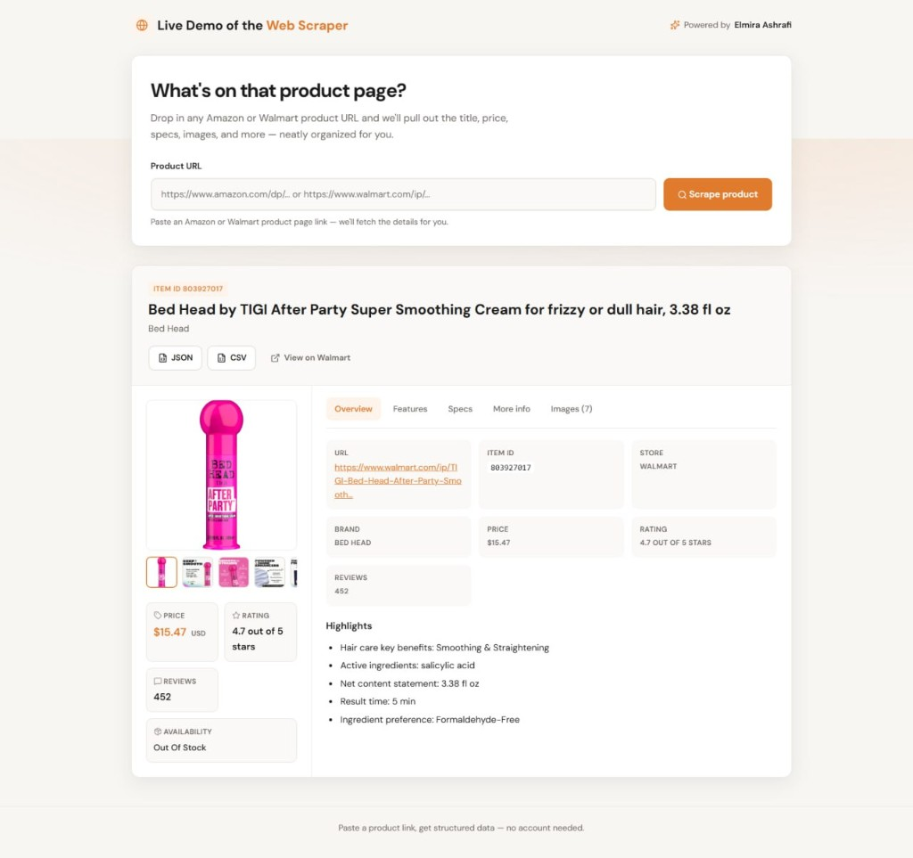

# Web Scraper

A Django web app that scrapes product details from **Amazon** and **Walmart** product pages. Paste a URL and get back the title, price, specs, images, variations, and more — organized in a clean UI with JSON and CSV export.

## Live demo

Try it online: **[https://web-scraper.ashrafisolutions.com](https://web-scraper.ashrafisolutions.com)**



## Features

- **Amazon & Walmart support** — automatically detects the store from the URL
- **Rich product data** — title, price, rating, availability, brand, description, specs, images
- **Variant switching** — browse and load different product options (size, color, configuration, etc.)
- **Export** — download scraped data as JSON or CSV
- **Bot-resistant fetching** — Amazon uses Opera (Playwright) with a fast Safari `curl_cffi` fallback; Walmart uses `curl_cffi`

## Requirements

- Python 3.10+
- pip
- [Opera](https://www.opera.com/download) browser installed on the system

## Setup

```bash
git clone https://github.com/elmira-ashrafi/web-scraper.git
cd web-scraper
pip install -r requirements.txt
python manage.py migrate
python manage.py runserver
```

If Opera is installed somewhere non-standard, point the scraper at it:

```bash
export OPERA_PATH="/path/to/opera"
```

Open [http://127.0.0.1:8000](http://127.0.0.1:8000) in your browser.

## Usage

1. Paste an Amazon or Walmart product URL into the input field.
2. Click **Scrape product**.
3. Review the extracted details in the results card.
4. Switch variants using the dropdown or swatches, if available.
5. Use **Download JSON** or **Download CSV** to export the data.

### Example URLs

```
https://www.amazon.com/dp/B0EXAMPLE
https://www.walmart.com/ip/product-name/123456789
```

## Project structure

```
web-scraper/
├── amazon_project/          # Django project settings
├── scraper/
│   ├── services/
│   │   ├── browser.py         # Playwright + Opera page fetcher
│   │   ├── amazon_scraper.py
│   │   ├── walmart_scraper.py
│   │   └── scraper.py       # Unified store router
│   ├── templates/
│   └── static/
├── manage.py
└── requirements.txt
```

## Tech stack

- **Django 4** — web framework
- **BeautifulSoup + lxml** — HTML parsing
- **Playwright + Opera** — Amazon page loading (variations, apparel specs)
- **curl_cffi** — Amazon fallback and Walmart page loading

## Notes

- Scraping may fail if Amazon or Walmart serves a CAPTCHA or bot-check page. Retry later or use a different network if that happens.
- Prices and availability reflect what is shown on the page at scrape time and can vary by region.

## License

MIT
